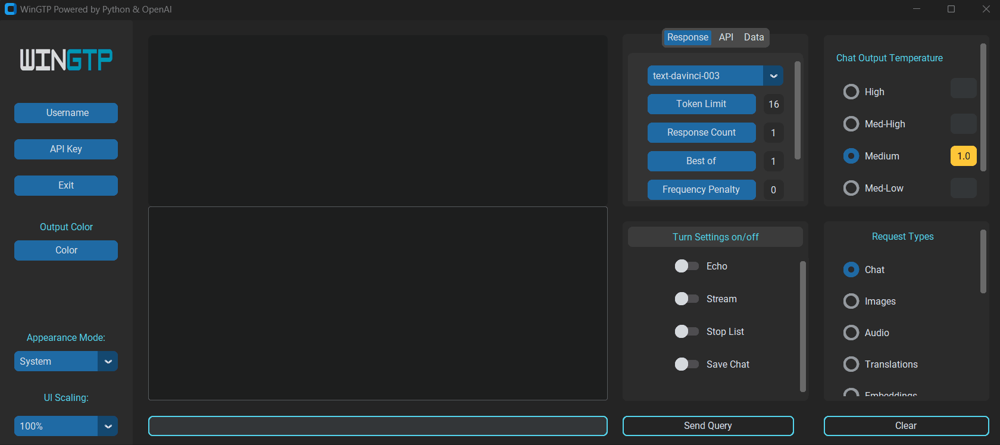
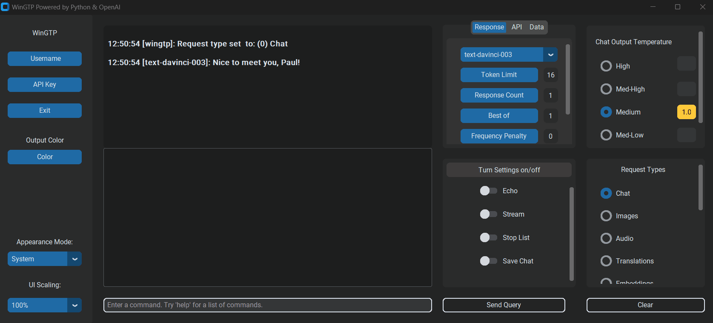
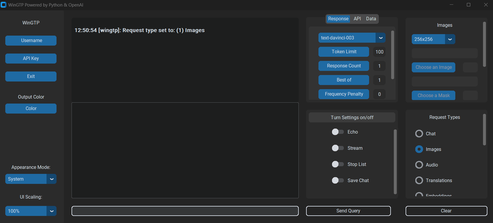
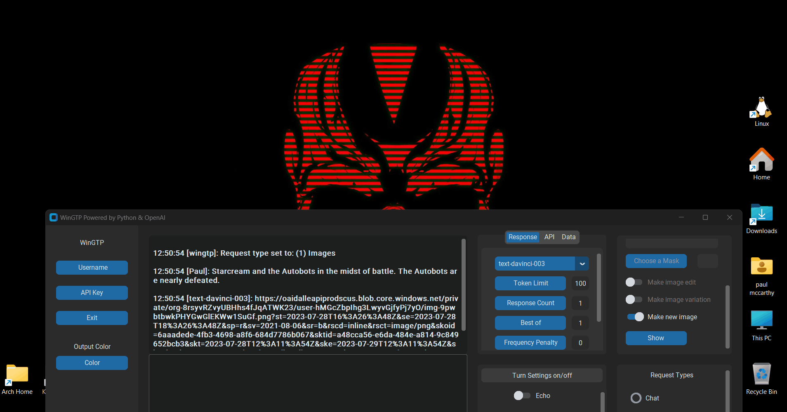
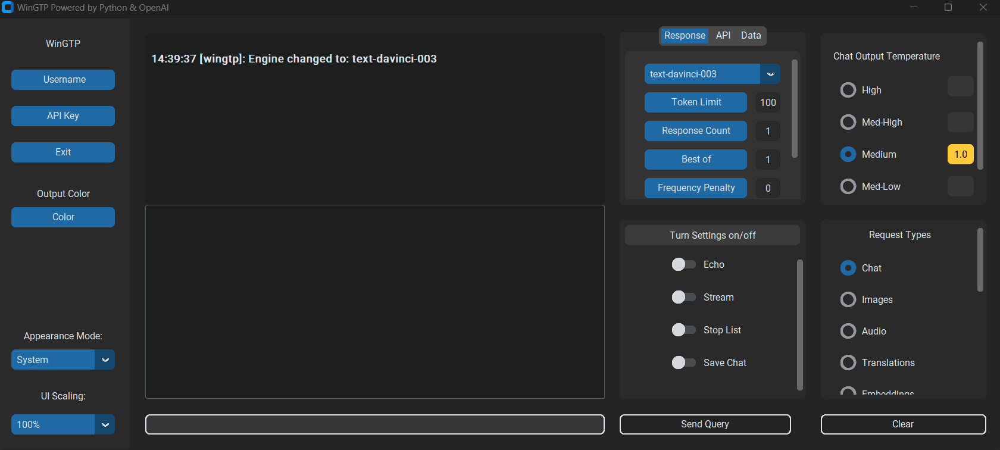
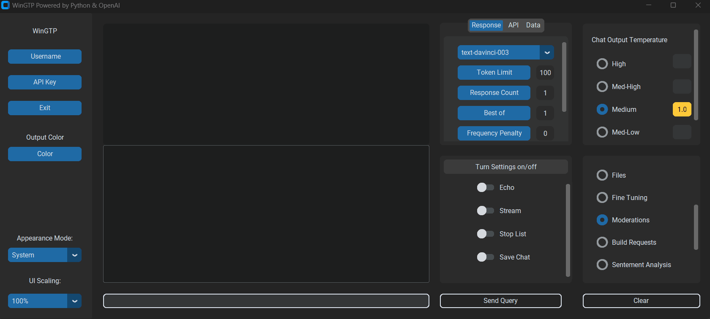
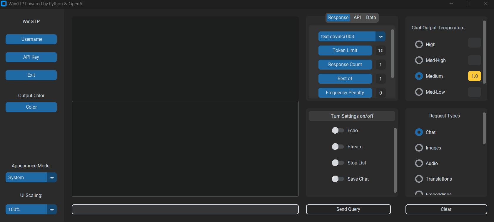
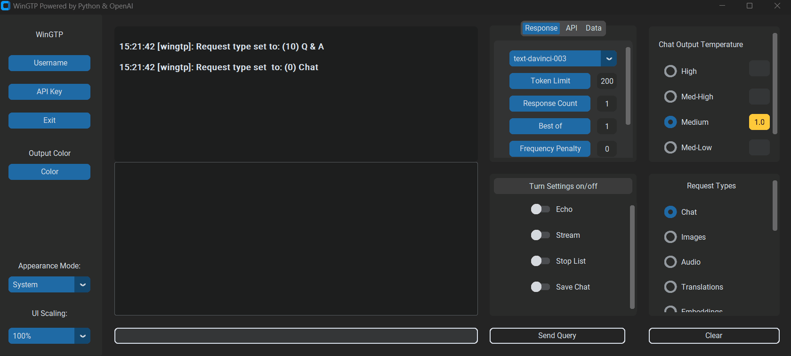
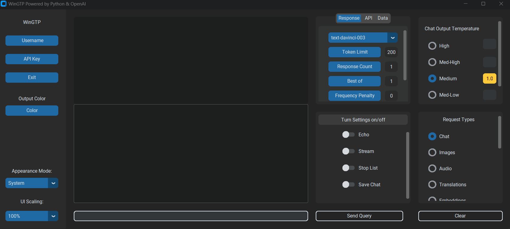
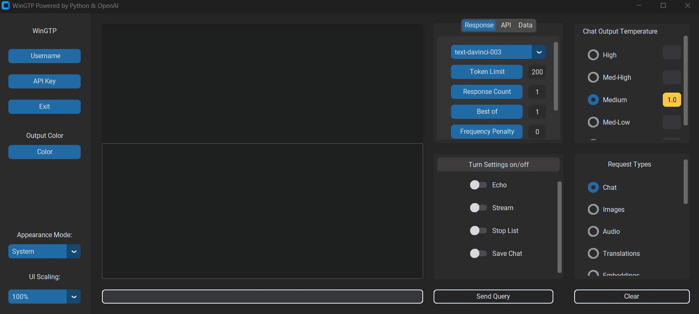

# WinGPT v1.0.0


> WinGPT is a cross-platform, fully functional, full-featured GUI implementation of the OpenAI API.
> You need a free OpenAI API key to use WinGPT. If you don't already have
> one you can find one at [https://openai.com/](https://openai.com/)

- [WinGPT v1.0.0](#wingpt-v100)
  - [About](#about)
    - [Cross-platform:](#cross-platform)
    - [Full-featured:](#full-featured)
    - [Control all api settings](#control-all-api-settings)
    - [Persistent Settings](#persistent-settings)
    - [Personalization Settings](#personalization-settings)
  - [Notes](#notes)
  - [Requirements](#requirements)
  - [Install](#install)
    - [Manual Install](#manual-install)
    - [Command Line Install](#command-line-install)
      - [Using Git Clone:](#using-git-clone)
      - [Using Curl:](#using-curl)
  - [Usage](#usage)
    - [OpenAI API Key](#openai-api-key)
    - [Running WinGPT](#running-wingpt)
      - [python](#python)
    - [Examples](#examples)
      - [Chat](#chat)
      - [Images](#images)
      - [Transcriptions](#transcriptions)
      - [Translations](#translations)
      - [Embeddings](#embeddings)
      - [Fine Tuning](#fine-tuning)
      - [Moderations](#moderations)
      - [Sentement Analysis](#sentement-analysis)
      - [Q&A](#qa)
      - [Code Generation](#code-generation)
      - [Edits](#edits)
      - [Summarization](#summarization)
  - [Contributing](#contributing)
  - [Security](#security)
    - [Reporting a vulnerability or bug?](#reporting-a-vulnerability-or-bug)
  - [Contacts](#contacts)

---

## [About](#about)

This is just version 1 of many updates to come still, so the GUI will improve vastly in the very near future. I really wanted to focus on functionality and wrapping
the GUI around the OpenAI API in a way that will give you full control over settings. I wanted to create a `1:1` wrapper around the API and I think WinGTP accomplishes that.

### [Cross-platform](#cross-platform)

Because WinGPT is built purely in Python, it will work on Windows, Mac and Linux operating systems.

### [Full-featured](#full-featured)

- Chat, files, audio transcription, image edits, image variations, new images, translations, embeddings, fine-tuning, moderations, sentement analysis, Q&A, summarization and code generation are all available and easy to use.

### [Control all api settings](#control-all-api-settings)

- Switch between all available models using a simple drop down menu.
- Easily control all available parameters such as: temperature, max tokens, response count, best of, frequency & presence penalty, timeout, user etc. from a modern GUI to easily adjust responses.
- Use user defined data files, and `.jsonl` data files.
- View and change other API settings like `api_type`, `api_base` and `api_version`.  
- Stream, echo, or save chat at any time.
- Create chat stop lists.

### [Persistent Settings](#persistent-settings)

- Your API key is stored so you only need to enter it once during setup and it will be automatically loaded on next startup.
- If you have multiple API keys, you can easily switch between them.
- Organization settings are also available to control which organization is used by default when making requests with your API keys.

### [Personalization Settings](#personalization-settings)

- Light, Dark & System themes are currently available.
- Easily change the color of the output and accent of the gui controls.
- UI scaling options are also available.



## [Notes](#notes)

> This an early ***Beta*** release of WinGPT. It's at a point where everything is completely functional yet vastly unpolished.
> Any feedback or [contributions](#contributing) are always welcomed. I started this from scratch over the past two weeks so there is still a ton to do.

---

## [Requirements](#requirements)

A few basic things are required to successfully setup and use WinGPT.

1) Firstly you need an active internet connection to run WinGPT. Because WinGPT makes calls
to the OpenAI API a connection is required.
2) Python 3.11 or higher: If Python isn't already installed you can find it on the official website here [https://www.python.org/](https://www.python.org/).
3) Lastly you need an API key to finish the WinGPT setup. Check out the [API Key](#openai-api-key) section.

## [Install](#install)

Currently there is no installer yet as WinGPT is still being actively developed. You can use it simply by running the `init.py` file with **Python 3.11** or higher or by using the included `wingpt-v0.1.0.bat` file which will run it for you.

Soon an executable will be available! once I feel version 1 is polished enough I'll bundle everything and release an executable for you to use, as I know running things from the command line isn't ideal for everyone.

To download and use WinGPT choose an install method and follow the corresponding steps. Once fininshed jump to the [Usage](#usage) section.

> You need a free OpenAI API key to finish the setup. If you don't already have see the [OpenAI API Key](#openai-api-key) section for detailed instructions on how to easily obtain one.

### [Manual Install](#manual-install)

1. Simply download and place the ***WinGPT*** folder in a location of your choosing then follow one of the methods in the [Usage](#usage) section to get started.

### [Command Line Install](#command-line-install)

#### [Using Git Clone:](#using-git-clone)

1) Open your terminal and navigate to the directory where you want to clone the repository: 

```bash
cd where/I/want/to/install
```

2) Next run the following command to clone the repository to the chosen location:

```bash
git clone https://github.com/happycod3r/WinGPT.git
```

#### [Using Curl:](#using-curl)

1) Pick a directory to download it to:

```bash
cd where/I/want/to/install
```

2) Paste the following line into your terminal and press the `Enter` key:

```bash
curl https://github.com/happycod3r/WinGPT.git
```

Once you have the repository cloned or downloaded your good to go. All you need
now is Python and and your OpenAI API key.

## [Usage](#usage)

### [OpenAI API Key](#openai-api-key)

> None of your personal information is required to use WinGPT except your [API Key](#openai-api-key)
> which is stored locally on your machine. Your API key is never shared or entered into
> any kind of database. Everything is local. OpenAI may collect data but you'll have to
> check out the OpenAI website as I am not affiliated, sponsered, or contracted with
> OpenAI in any way, shape or form. I'm just a dude in a place.

**!!!Any API keys used in these examples were deleted immediately after!!!**

This step is really important to setup in order to use WinGPT. Since the application
is wrapped around the Python `openai` module heavily you need an OpenAI API key to use it.
You can easily obtain a free API key by following the next few steps.

1) Go to [https://openai.com/](https://openai.com/) and either create a free account
manually or continue using **Google** or any other option for the quickest setup.


---

2) Once you have an account created click on your profile picture and then **"View API Keys"**.


---

3) Next you will be met with a page like this where you can access or create new API keys.
Create a new key to use if you don't already have one.


---

4) Once you have an api key you can use it to setup WinGPT. Enter your username and
then the API key below it.


---

### [Running WinGPT](#running-wingpt)

1) To start WinGPT on Windows you can double-click the `wingpt-0.1.0.bat` file.

Notice! When running `wingpt-0.1.0.bat`, Windows security might alert you
about the file being unsafe. This can be ignored as it is completely safe. This file
simply runs the `init.py` file using the `python` command which starts WinGPT.

```bash
# wingpt-0.1.0.bat
python "./init.py"
```

2) Next you will see a setup screen where you should enter a username that you would
like to use within WinGTP and your OpenAI API key.

> Just to reiterate, without an API key you will not be able to access WinGPT as none of it's features
> will work without it. If you need further instructions on how to obtain one check the previous section: [OpenAI API Key](#openai-api-key)

#### [python](#python)

1) WinGPT was built using Python 3.11 so make sure you are using the same or newer.
2) In your terminal navigate to the WinGPT root directory.

```bash
cd WinGPT
```

3) Finally, run the following command to start WinGPT:

```bash
python init.py
```

---

Once the setup window closes you will then be greeted by WinGPT with a greeting including the username that you provide to let you know everything was set up successfully.

The following are examples of some of the main features of WinGPT mentioned in the [About](#about) section.

### [Usage Examples](#examples)

#### [Chat](#chat)

Type anything into the input box below the output and get an immediate response.
You can also try changing settings such as the `response token limit` or the `chat output temperature`
to change the response parameters.



#### [Images](#images)

You can either generate new images, edit an existing image or create variations
of an image.

- First select the `Images` request type from the `Request Types` section
- Once selected the image settings will open in the top right section in place of the `Chat Output Temperature`
section. These setings allow you to pick an image size and open existing images and or masks.
- Lastly press the `Send` button to get the URL of the image.

You can type anything you want to create a new image. After pressing the `Send` button
it may take a second to get the URL as you can see in this example. This is due to OpenAI
and theres not much I can do about it. As for WinGPT hanging when waiting for a
response, I will be working out a solution to this in the near future when I find one.



When you are done creating the image you can either copy the URL or view the image from within WinGPT.



#### [Transcriptions](#transcriptions)

You can also create audio transcriptions in the same manner as images. Remember to pick the
correct model for each request type otherwise you won't get a response. 

> NOTE: In the near future I will implement a system that will alert you if you're not using the correct model for the specific request type or have incorrect settings/parameters enabled.

For audio transcriptions you can use `whisper-1`.

- First select `Audio` from the list in the `Request Types` section.
- Next press the `Choose Audio File` button to open the audio file you want to
transcribe.
- Once you have chosen a valid audio file press the `Transcribe` button.


#### [Translations](#translations)

You can also easily make translations. Don't forget to choose the correct model type from the **Models** drop-down
otherwise it may not work as expected or at all.

- First you need to choose the `Translations` option in the `Request Types` section.
- You will see langauge options open in the top right section.
- Choose a language to translate from and a language to translate to.
- Once you have selected your languages, type or paste anything into the input box and press
the `Send` button to get the translation.


#### [Embeddings](#embeddings)

Embeddings can be created from within WinGPT as well. Since embeddings tend to be really long
it may take a second to recieve the response. I will be working on execution speed
and other issues in the near future. As with images and transcriptions, remember to choose
the correct model for the job.

For embeddings you can use `text-embedding-ada-002`

- First you need to choose the `Embeddings` option in the `Request Types` section.

#### [Fine Tuning](#fine-tuning)

> Section coming soon! Still working on this request type.

#### [Moderations](#moderations)

Use the moderations section to gague any text that you may want to analyze.
This can be helpful to use if you have messages or comments that you may want to filter
for any reason. Since the response from the OpenAI API is a dictionary you can even
write a program around moderations soley since you can get the values of each section easily.

For moderations the model type doesn't matter.



Heres an example of a message that should be flagged.



#### [Sentement Analysis](#sentement-analysis)

You can also perform sentement analysis by typing anything into the input box
and pressing the `Send` button. You can also change the `response token limit` to get
shorter or longer answers.



#### [Q&A](#qa)

The `Q&A` request type allows you to enter a context and base questions and answers off of it.
This is helpful if you want to steer the responses in a specific direction.



#### [Code Generation](#code-generation)

Code generation can be helpful if your someone who is just learning how to code or even if
your experienced. Why get stuck on a problem for hours trying to go through different forums like
Stack Overflow - Not that they weren't super helpful through the years! - and be bombarded by ads on Google and other sites when you can just ask
and get a straight answer.



#### [Edits](#edits)

The `Edits` request type allows you to do things such as convert all text to lowercase/uppercase,
fix spelling errors, check punctuation and more. Just choose the type of edit you would
like to perform from the drop down in the `Edit View`. Next paste in or type anything into the 
input box and press the `Send` button.


#### [Summarization](#summarization)

When `Summarization` is chosen, anything that you enter into the text box will be summarized.
You should play with the settings such as `Response Token Limit` and `Chat Output Temperature` to
get different results.



---

## [Contributing](#contributing)

If you have any feature requests, suggestions or general questions you can reach me via any of the
methods listed below in the [Contacts](#contacts) section. Contributions are always welcome!

---

## [Security](#security)

### Reporting a vulnerability or bug?

**Do not submit an issue or pull request**: A general rule of thumb is to never publicly report bugs or vulnerabilities because you might inadvertently reveal it to unethical people who may use it for bad. Instead, you can email me directly at: [paulmccarthy676@gmail.com](mailto:paulmccarthy676@gmail.com). I will deal with the issue privately and submit a patch as soon as possible.

---

## [Contacts](#contacts)

**Author:** Paul M.

- Email: [paulmccarthy676@gmail.com](mailto:paulmccarthy676@gmail.com)
- Github: [https://github.com/happycod3r](https://github.com/happycod3r)
- Linkedin: [https://www.linkedin.com/in/paul-mccarthy-89165a269/]( https://www.linkedin.com/in/paul-mccarthy-89165a269/)
- Facebook: [https://www.facebook.com/paulebeatz]( https://www.facebook.com/paulebeatz)

---
