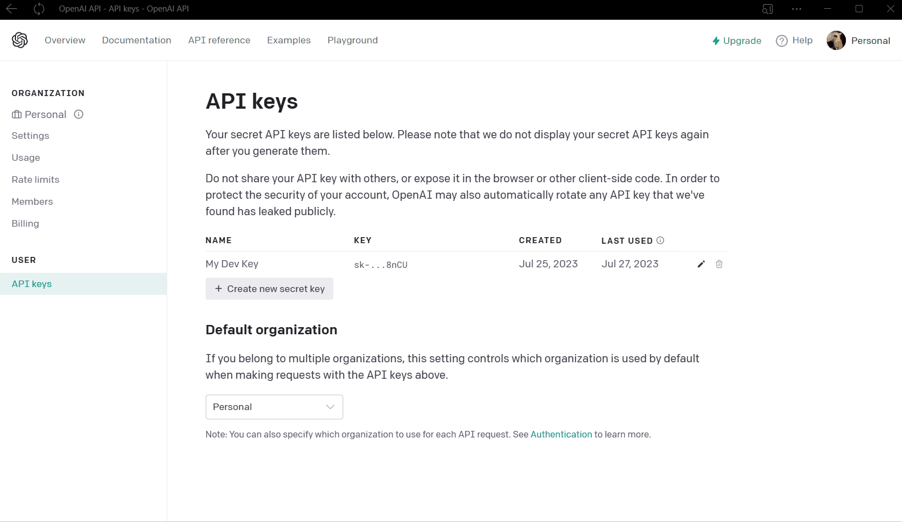

# WinGPT v1.0.0


> WinGTP is a cross-platform, fully functional, full-featured GUI implementation of the OpenAI API.
> You need a free OpenAI API key to use WinGTP. If you don't already have 
> one you can find one at [https://openai.com/](https://openai.com/) 

- [WinGPT v1.0.0](#wingpt-v100)
  - [About](#about)
    - [Cross-platform:](#cross-platform)
    - [Full-featured:](#full-featured)
    - [Control all api settings](#control-all-api-settings)
    - [Persistent Settings](#persistent-settings)
    - [Personalization Settings](#personalization-settings)
  - [Notes](#notes)
  - [Requirements](#requirements)
  - [Install](#install)
    - [Manual Install](#manual-install)
    - [Command Line Install](#command-line-install)
      - [Using Git Clone:](#using-git-clone)
      - [Using Curl:](#using-curl)
  - [Usage](#usage)
    - [OpenAI API Key](#openai-api-key)
  - [](#)
  - [](#-1)
  - [](#-2)
  - [](#-3)
    - [Running WinGTP](#running-wingtp)
      - [python](#python)
  - [Contributing](#contributing)
  - [Security](#security)
    - [Reporting a vulnerability or bug?](#reporting-a-vulnerability-or-bug)
  - [Contacts](#contacts)

---

## [About](#about)

### [Cross-platform](#cross-platform): 
Because WinGTP is built purely in Python, it will work on Windows, Mac and Linux operating systems.

### [Full-featured](#full-featured):

* Chat, files, audio transcription, image edits, image variations, new images, translations, embeddings, fine-tuning, moderations, sentement analysis, q&a, summarization and code generation are all available and easy to use. 

### [Control all api settings](#control-all-api-settings)
* Switch between all available models using a simple drop down menu.
* Easily control all available parameters such as: temperature, max tokens, response count, best of, frequency & presence penalty, timeout, user etc. from a modern gui to easily adjust responses.
* Use user defined data files, and jsonl data files. 
* View and change other settings like api_type, api_base and api_version.  
* Stream, echo, or save chat at any time.
* Create chat stop lists. 

### [Persistent Settings](#persistent-settings)
* Your api key is stored so you only need to enter it once during setup and it will be automatically loaded on next startup. 
* If you have multiple api keys, you can easily switch between them. 

* Organization settings are also available to control which organization is used by default when making requests with your API keys       

### [Personalization Settings](#personalization-settings)
* Light, Dark & System themes are currently available. 
* Easily change the color of the output and accent of the gui controls.
* UI scaling options are also available 

* This is just version 1 of many updates to come still so the gui will improve vastly in the very near future. I'm a one man show and really wanted to focus on functionality and wrapping 
the gui around the openai. I wanted to create a 1|1 wrapper around the api and I think WinGTP accomplishes that.


## [Notes](#notes)

> This an early ***Beta*** release of WinGTP. It's at a point where everything is completely functional yet vastly unpolished.
> Any feedback is always appreciated. I started this from scratch over the past two weeks so there is still a ton to do.

---

## [Requirements](#requirements)

A few basic things are required to successfully setup and use WinGTP.

1) Firstly you need an active internet connection to run WinGTP. Because WinGTP makes calls
to the OpenAI api a connection is required.
2) Python 3.11 or higher: If python isn't already installed you can find it on the official website here [https://www.python.org/](https://www.python.org/).
3) Lastly you need an api key to finish the WinGTP setup. Check out the [API Key](#openai-api-key) section.

## [Install](#install)
Currently there is no installer yet as WinGTP is still being actively developed. You can use it simply by running the `init.py` file with **Python 3.11** or higher or by using the included `wingtp-v0.1.0.bat` file which will run it for you.

Soon an executable will be available! once I feel version 1 is polished enough I'll bundle everything and release an executable for you to use, as running things from the command line isn't ideal for everyone.

To download and use WinGTP choose an install method and follow the corresponding steps. Once fininshed jump to the [Usage](#usage) section.

> You need a free OpenAI API key to finish the setup. If you don't already have 
> one you can find one at [https://openai.com/](https://openai.com/) 

### [Manual Install](#manual_install) 

1. Simply download and place the ***WinGTP*** folder in a location of your choosing then follow one of the methods in the [Usage](#usage) section to get started.

### [Command Line Install](#command_line_install)

#### [Using Git Clone:](#git_clone)

1) Open your terminal and navigate to the directory where you want to clone the repository: 

```bash
cd where/I/want/to/install
```

2) Next run the following command to clone the repository to the chosen location:
```bash
git clone https://github.com/happycod3r/WinGTP.git
```

#### [Using Curl:](#curl)

1) Pick a directory to download it to:
```bash
cd where/I/want/to/install
```

2) Paste the following line into your terminal and press the `Enter` key:
```bash
curl https://github.com/happycod3r/WinGTP.git
```

Once you have the repository cloned or downloaded your good to go. All you need 
now is Python and an api key from 

## [Usage](#usage)

### [OpenAI API Key](#openai-api-key)

> None of your personal information is required to use WinGTP except your [API key]() 
> which is stored locally on your machine. Your api key is never shared or entered into 
> any kind of database. Everything is local. OpenAI may collect data but you'll have to 
> check out the OpenAI website as I am not affiliated, sponsered, or contracted with 
> OpenAI in any way, shape or form.

**!!!Any API keys used in these examples were deleted immediately after!!!**

This step is really important to setup in order to use WinGTP. Since the application 
is wrapped around the Python `openai` module heavily you need an OpenAI api key to use it. 
You can easily obtain a free api key by following the next few steps.

1) Go to [https://openai.com/](https://openai.com/) and either create a free account 
manually or continue using **Google** or any other option for the quickest setup.


---

2) Once you have an account created click on your profile picture and then **"View API Keys"**.


---

3) Next you will be met with a page like this where you can access or create new api keys.
Create a new key to use if you don't already have one.


---

4) Once you have an api key you can use it to setup WinGTP. Enter your username and
then the api key below it. 


---

### [Running WinGTP](#running)

1) To start WinGTP on Windows you can double-click the `wingtp-0.1.0.bat` file.

Notice! When running `wingtp-0.1.0.bat`, Windows security might alert you
about the file being unsafe. This can be ignored as it is completely safe. This file
simply runs the `init.py` file using the `python` command which starts WinGTP.

```bash
# wingtp-0.1.0.bat
python "./init.py"
``` 

2) Next you will see a setup screen where you should enter a username that you would 
like to use within WinGTP and your OpenAI api key. 
> Without an api key you will not be able to access WinGTP as none of it's features 
> will work without it. If you need further instructions on how to obtain one check 
> out the [OpenAI API Key](#openai-api-key) section.

#### [python](#python)

1) WinGTP was built using Python 3.11 so make sure you are using the same or newer.
2) In your terminal navigate to the WinGTP root directory.
```bash
cd WinGTP
```
3) Finally, run the following command to start WinGTP:

```bash
python init.py
```
---

Once the setup winow closes you will then be greeted by GTP with a greeting including your 
username and your good to go.

The following are examples of some of the main features mentioned in the [About](#about) section.
 

## [Contributing](#contributing)

If you have any feature requests, suggestions or general questions you can reach me via any of the 
methods listed below in the [Contacts](#contacts) section.

---

## [Security](#security)

### Reporting a vulnerability or bug?

**Do not submit an issue or pull request**: A general rule of thumb is to never publicly report bugs or vulnerabilities because you might inadvertently reveal it to unethical people who may use it for bad. Instead, you can email me directly at: [paulmccarthy676@gmail.com](mailto:paulmccarthy676@gmail.com). I will deal with the issue privately and submit a patch as soon as possible.

---

## [Contacts](#contacts)

**Author:** Paul M.

* Email: [paulmccarthy676@gmail.com](mailto:paulmccarthy676@gmail.com)
* Github: [https://github.com/happycod3r](https://github.com/happycod3r)
* Linkedin: [https://www.linkedin.com/in/paul-mccarthy-89165a269/]( https://www.linkedin.com/in/paul-mccarthy-89165a269/)
* Facebook: [https://www.facebook.com/paulebeatz]( https://www.facebook.com/paulebeatz)

---
